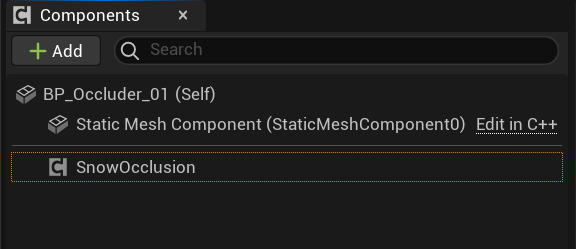
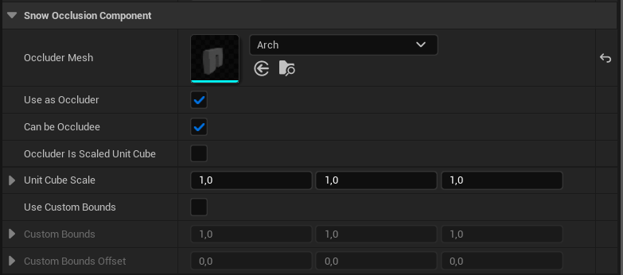
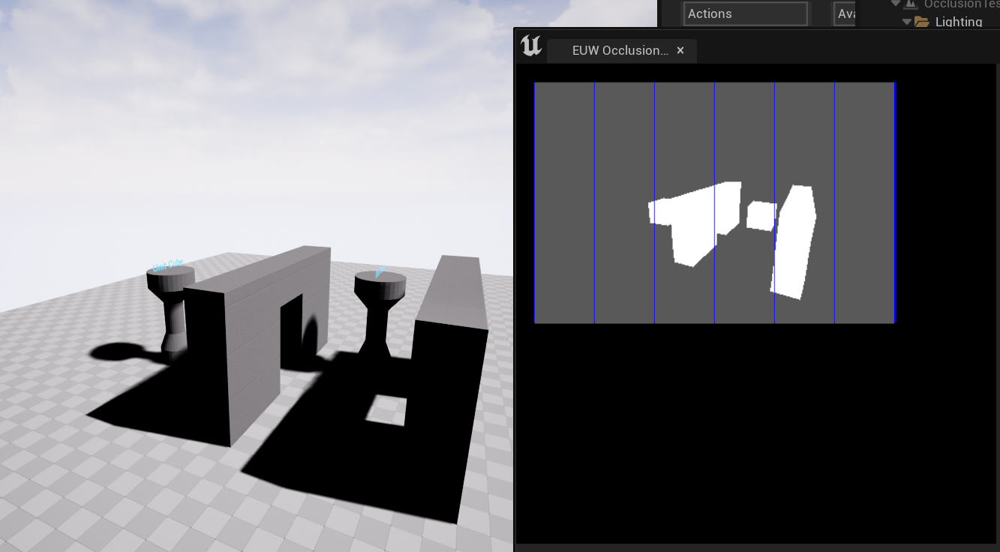

With Unreal 5, Epic removed the built-in support for CPU based occlusion culling as it was considered a temp solution.
As FTG games are very heavy on the GPU we are very much in need of a CPU based system where we usually have more perf to spare. The solution was to port and extend the UE4 system to UE5.

The result is an engine subsystem named Snow Occlusion Subsystem found in the SnowOcclusion plugin.

## Important Terms
### Occluder
An object that can hide other objects. Typically large objects such as wall pieces. These are used to determine visibility of **occludees**

### Occludee
An object that can be occluded by an occluder and have its visibility state changed, i.e. if an occludee is occludded by an occluder, it will not be rendered.

An occluder can always be an occludee, but an occludee does not have to be an occluder. The behaviour is configure. Read on to find out how.

## Snow Occlusion Subsystem
### Goals
* **Mesh types**: The legacy Unreal system worked with static meshes only by dedicating a specific LOD level to be used as an occlusion mesh. As we often have other types of meshes such as skeletal meshes that we want to cull, supporting these were a main requirement.
* **Standalone plugin**: The legacy system was part of the core rendering pipe leaving no room for extending it or customizing it. Instead of re-adding the system we wanted to take the chance of creating something that lives outside of the engine and can be brought to all projects.
* **Extensible**: The bundled Snowball setup will always cover the base use cases (toggle visibility), but by basing the occluders/occludees on components, game teams can extend the system and react to culling in a game specific manner. Anything with an occlusion component can be in the mix.

### Overview
The occlusion culling is handled by an engine subsystem (SnowOcclusionSubsystem) that is spawned when the engine is spawned and keeps running until the engine is shutdown.
The basic functionality works with any Actor that has a primitive component and a special occlusion component (USnowOcclusionComponent) attached.

ONLY Actors with an USnowOcclusionComponent component will be considered an occluder or an occludee. To be clear: you MUST place an USnowOcclusionComponent component on ALL Actors that should be part of the occlusion process.

### USnowOcclusionComponent
The USnowOcclusionComponent references a StaticMesh that is used as the occluder. The nice thing with this setup is that you can have a completely different mesh as an occluder compared to the legacy system where a dedicated LOD level was used.

The component also exposes bools indicating if the mesh should be used only as an occluder or if the Actor should only act as an occludee, i.e. if it should only be culled but not be part of occluding something else.

IMPORTANT: *The Occluder Mesh is only used by occluders*. When the system checks the visbility of an occludee, the bounds of the first primitive found on the actor is used. This means the system is at its best the more "square"-like the primitives are. Sometimes the mesh primitive's bounds aren't satisfying for an occludee (for instance when multiple primitives exist on an actor) and in those cases you an supply your own custom bounds.

### Basic Setup
To enable a StaticMeshActor or similar to act as an occluder and be culled simply add a SnowOcclusionComponent to the actor hiearchy.

For it to act as an occluder you must specify an occluder mesh. You can also specify if the actor should be part of occluding other meshes or not and if the mesh can be occluded or not.

For many meshes a simple box geometry suffices as an occluder mesh. For this use case one can check the "Occluder is scaled unit cube" checkbox and provide the desired dimensions in meters the box should have, i.e. a scale of 2 x 2 x 2 will yield an occludion mesh of 2m x 2m x 2m centered around the bounds origin.
IMPORTANT: You still need to provide a unit cube mesh as the occluder mesh. One is bundled with the SnowOcclusion content folder. 
Please note that the "unity cube" doesn't have to be a cube mesh. It can be whatever form you want to scale.

The plugin comes with a simple test map located in the SnowOcclusion content.

### Debug
To visualize occluders an Editor Utility Widget exist. It is located together with the example map named: **EUW_OcclusionDebug**. To use it do the following:
* Start the widget by right clicking it and choose "Run Editor Utility Widget"
* To enable debug drawing issue the console command: "r.so.VisualizeBuffer 1"
* To actually see the result you need to play in editor and fly around as this is a runtime system and not a core rendering system.
* All the stats and settings from the UE4 system is still around to help with debugging and profiling.

